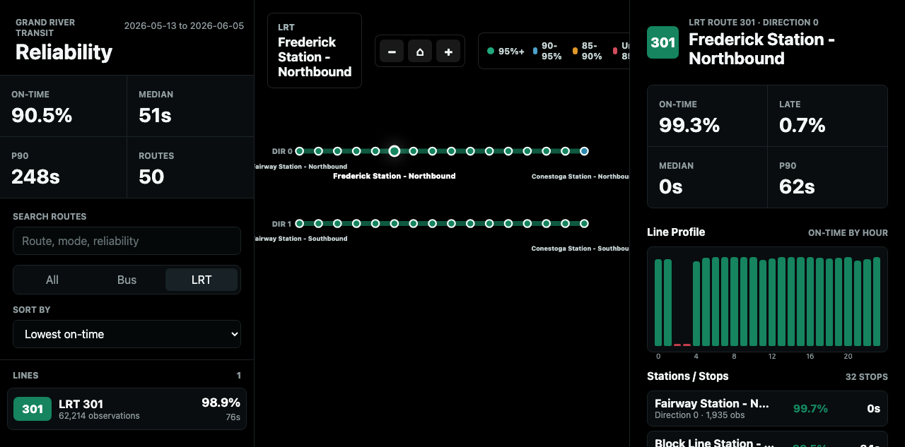

# Reliability Dashboard

Static frontend for exploring GRT reliability summaries.



## Build Data

Generate reliability tables first, then export dashboard JSON:

```bash
collector/.venv/bin/python analysis/build_reliability_tables.py
collector/.venv/bin/python analysis/export_dashboard_data.py
```

The exporter writes `dashboard/data/dashboard-data.json`. That file is generated
from local analysis data and is intentionally ignored by Git.

## Run Locally

```bash
collector/.venv/bin/python -m http.server 8765 --directory dashboard
```

Open `http://127.0.0.1:8765/`.

## UI

- Route reliability map built from latest static GTFS shapes
- Route search, mode filter, and sorting
- Click routes from the map or list
- Selecting a route swaps the map for a line diagram with one rail per
  direction; click a station dot (or a row in the stop table) to drill into
  stop-level metrics
- Mouse wheel or trackpad to zoom
- Drag to pan
- Use `-`, home, and `+` buttons to zoom out, reset, and zoom in
- Live panel with model-predicted delays for upcoming arrivals (system-wide
  and per route), refreshed every minute
- Transfers panel with historical connection success rates: riskiest
  connections system-wide, or connections from the selected route; click a
  row to jump to the destination route

## Live Predictions

The live panel reads `data/live-predictions.json`, written by the live scorer:

```bash
collector/.venv/bin/python analysis/predict_live.py --interval-seconds 300
```

The panel hides itself when the file is missing and shows a "stale" badge when
the last scoring run is more than 10 minutes old.

## Transfers

Transfer success rates come from `analysis/build_transfer_reliability.py`;
run it before `export_dashboard_data.py` to include them in the dashboard
JSON. The section hides itself when no transfer data is present.
